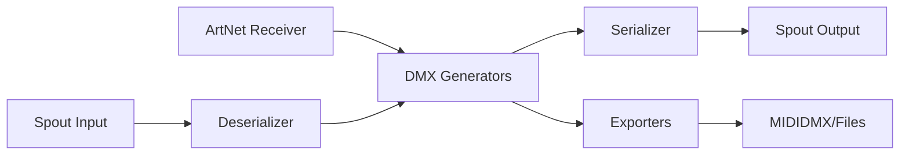

## What is HNode?

HNode is an open-source ArtNet DMX to video grid node renderer built in Unity 6. It enables real-time conversion of DMX lighting control data into video streams, making it perfect for integrating lighting systems with virtual environments, VRChat worlds, and video streaming platforms.

<CardGroup cols={2}>
  <Card title="Universal DMX Support" icon="signal">
    Receive ArtNet DMX data from any lighting console and render it to video
  </Card>
  <Card title="Multiple Serializers" icon="grid">
    Support for VRSL, Binary Stage Flight, and many other grid formats
  </Card>
  <Card title="Real-time Streaming" icon="video">
    Output via Spout2 for integration with OBS, video players, and streaming services
  </Card>
  <Card title="Advanced Generators" icon="wand-magic-sparkles">
    Text, subtitles, time codes, MIDI, and more built-in data generators
  </Card>
</CardGroup>

## Key Features

### DMX Serialization

HNode supports multiple DMX serialization formats, allowing you to work with different lighting systems and virtual world standards:

- **VRSL** - Industry standard for VRChat lighting systems
- **Binary Stage Flight** - High-density binary encoding for complex shows
- **Ternary** - Three-state encoding for specific use cases
- **Color Binary** - RGB color-optimized format
- **Spiral** - Custom spiral pattern layout
- **Furality Somna** - Event-specific format

### Spout2 Integration

<Note>
  Spout2 is a real-time video sharing framework for Windows that allows applications to share GPU textures with near-zero latency.
</Note>

HNode provides both **Spout2 output** (serializer) and **Spout2 input** (deserializer):

```csharp
// Default Spout names
SpoutOutputName: "HNode Output"
SpoutInputName: "HNode Input"
```

This enables:
- **Output to OBS Studio** for streaming and recording
- **Input from other applications** for transcoding between formats
- **Zero-copy GPU texture sharing** for maximum performance

### Data Generators

HNode includes powerful generators for creating DMX data beyond ArtNet input:

<AccordionGroup>
  <Accordion title="Text Generator">
    Display text on DMX channels with UTF-8 or UTF-16 encoding. Perfect for displaying song lyrics, messages, or dynamic content.
    
    ```csharp
    public string text = "Hello World";
    public DMXChannel channelStart = 0;
    public bool unicode = false;
    public bool limitLength = false;
    public int maxCharacters = 32;
    ```
  </Accordion>

  <Accordion title="Subtitle Generators">
    Support for multiple subtitle formats:
    - **SRT (SubRip)** - Industry standard subtitle format
    - **ASS (Advanced SubStation Alpha)** - Advanced styling and positioning
    - **LRC (Lyrics)** - Time-synced lyrics for music
  </Accordion>

  <Accordion title="Time & Timecode">
    - **Time Generator** - Current system time display
    - **TimeCode Exporter** - SMPTE timecode output for show synchronization
  </Accordion>

  <Accordion title="DMX Packet Generator">
    Optimized DMX packet transmission that only sends changed channels:
    
    ```csharp
    // Efficiently transmits only differences
    // Includes idle scanning for reliability
    // Automatic packet chunking for large data
    ```
  </Accordion>

  <Accordion title="Other Generators">
    - **Static Value** - Set constant values on channels
    - **Strobe** - Programmable strobe effects
    - **Fade** - Smooth transitions between values
    - **Remap** - Channel remapping and routing
    - **Twitch Chat** - Display Twitch chat messages
  </Accordion>
</AccordionGroup>

### MIDIDMX Exporter

<Tip>
  MIDIDMX enables DMX output to VRChat worlds using MIDI as a transport protocol. Perfect for controlling lights in virtual venues!
</Tip>

Integration with [VRC-MIDIDMX](https://github.com/micksam7/VRC-MIDIDMX) for VRChat world lighting:

```csharp
public string midiDevice = "loopMIDI Port";
public int channelsPerUpdate = 100;
public int idleScanChannels = 10;
```

Supports up to **16,384 DMX channels** with intelligent channel updates and watchdog monitoring.

### Performance Monitoring

<CardGroup cols={2}>
  <Card title="Real-time Statistics" icon="chart-line">
    Built-in Graphy performance monitor displays FPS, RAM usage, and audio levels
  </Card>
  <Card title="Configurable Framerate" icon="gauge">
    Adjust target framerate (default 60 FPS) to balance quality and performance
  </Card>
</CardGroup>

## Architecture Overview

### Core Components

HNode's architecture follows a modular plugin-based design:



#### Input Layer

**ArtNet Receiver**: Listens for DMX data over the network

```csharp
public int ArtNetPort { get; set; } = 6454;
public SerializableIPAddress ArtNetAddress { get; set; } = IPAddress.Any; // 0.0.0.0
```

**Spout Input**: Receives video streams from other applications for transcoding

#### Processing Layer

**DMX Generators**: Transform, generate, or manipulate DMX channel data
- Implement `IDMXGenerator` interface
- Process channel data in real-time
- Support for dynamic UI configuration

**Serializers/Deserializers**: Convert between DMX data and video pixels
- Implement `IDMXSerializer` interface
- Handle channel-to-pixel mapping
- Support multiple grid layouts (horizontal, vertical)

#### Output Layer

**Spout Output**: Shares rendered video via GPU texture

**Exporters**: Send data to external systems
- MIDIDMX for VRChat integration
- Text file export for debugging
- Timecode output for synchronization

### Data Flow

<Steps>
  <Step title="Receive ArtNet">
    ArtNet DMX data arrives on UDP port 6454 (configurable)
  </Step>
  
  <Step title="Generate & Process">
    Generators manipulate the DMX channel array (up to 512 channels per universe)
  </Step>
  
  <Step title="Serialize to Video">
    Serializer converts DMX bytes to Color32 pixel array based on selected format
  </Step>
  
  <Step title="Output">
    Video frame sent via Spout2, exporters send data to external systems
  </Step>
</Steps>

### Configuration System

HNode uses YAML for show configurations:

```yaml
Serializer: !VRSL
GammaCorrection: true
RGBGridMode: false
OutputConfig: HorizontalTop

Transcode: false
TranscodeUniverseCount: 3
SerializeUniverseCount: 2147483647

ArtNetPort: 6454
ArtNetAddress: 0.0.0.0
SpoutOutputName: HNode Output
SpoutInputName: HNode Input
TargetFramerate: 60
OutputResolution: 1920x1080
InputResolution: 1920x1080
```

<Warning>
  Show configuration files contain all settings for serializers, generators, and exporters. Save configurations before closing HNode to preserve your setup!
</Warning>

## Use Cases

### Virtual World Lighting

Control lights in VRChat or other virtual environments by streaming DMX data as video. Perfect for:
- Virtual nightclubs and concert venues
- Stage lighting in virtual events
- Dynamic environmental lighting
- Synchronized light shows

### OBS Integration

Capture HNode output in OBS Studio for:
- Live streaming with synchronized lighting visuals
- Recording light shows for content creation
- Compositing lighting effects with other video sources
- Low-latency local streaming with MediaMTX

### Format Transcoding

Convert between different DMX serialization formats:
- Transcode from one grid format to another
- Test different serializers without changing your lighting console setup
- Bridge incompatible systems

### Development & Testing

Use HNode's generators for:
- Testing virtual world lighting systems without a lighting console
- Generating test patterns and sequences
- Debugging DMX channel mappings
- Prototyping new lighting effects

## System Requirements

<CardGroup cols={2}>
  <Card title="Operating System" icon="windows">
    Windows 10/11 (64-bit)
    
    Spout2 requires Windows
  </Card>
  
  <Card title="Graphics" icon="display">
    DirectX 11 compatible GPU
    
    Dedicated GPU recommended for high channel counts
  </Card>
  
  <Card title="Network" icon="network-wired">
    Network adapter for ArtNet
    
    Gigabit ethernet recommended for high universe counts
  </Card>
  
  <Card title="Runtime" icon="code">
    Built with Unity 6 (6000.2.7f2)
    
    No additional runtime required
  </Card>
</CardGroup>

## Next Steps

<CardGroup cols={2}>
  <Card title="Installation" icon="download" href="/installation">
    Download and set up HNode on your system
  </Card>
  
  <Card title="Quick Start" icon="rocket" href="/quickstart">
    Get your first ArtNet stream running in minutes
  </Card>
</CardGroup>
